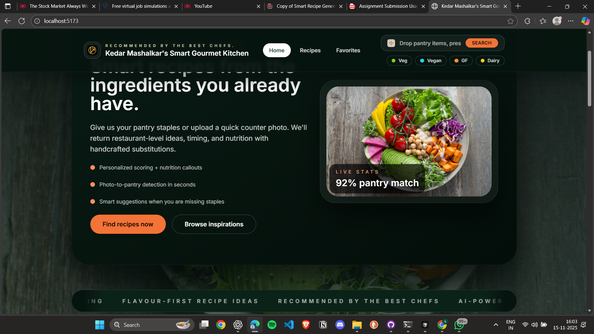
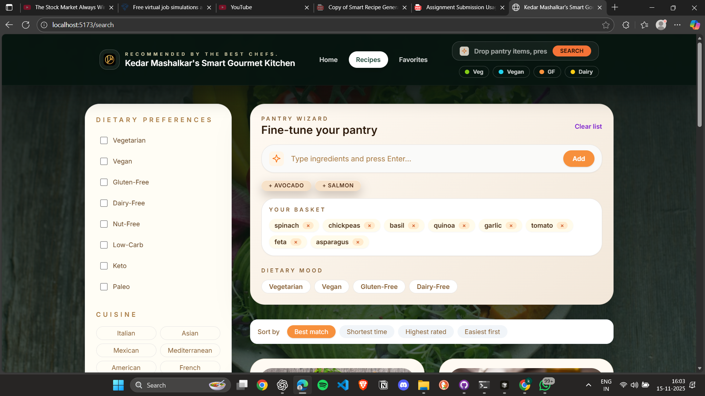
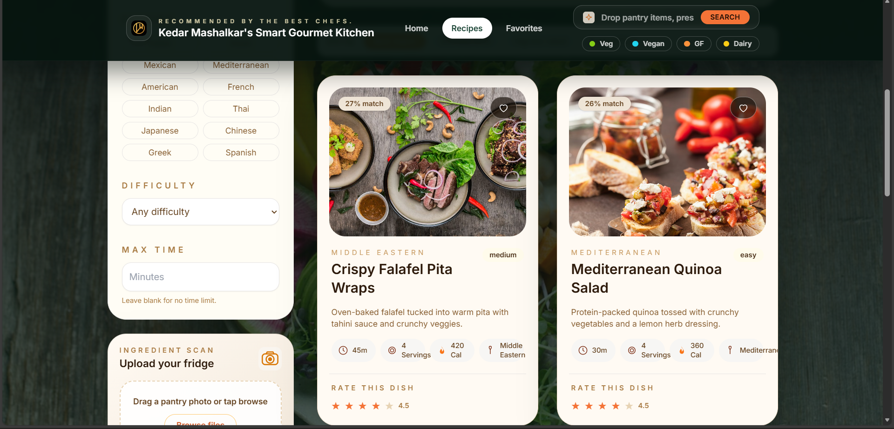
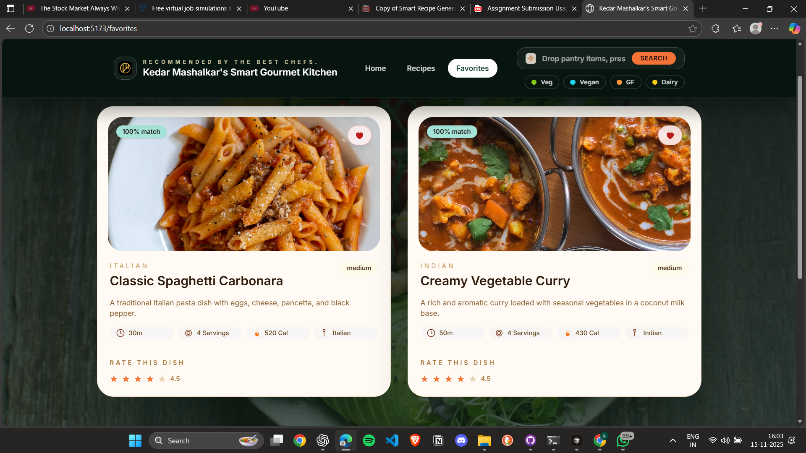

# Kedars Smart Recipe Generator

Smart Gourmet Kitchen is a pantry-first recipe coach. Type or photograph what you have, layer on dietary filters, and the app recommends chef-style dishes with nutrition, substitutions, and serving controls.

## 1. Working Application URL
| Environment | URL |
|-------------|-----|
| **Live** | https://kedarssmartgourmetkitchen-git-main-kedar-mashalkars-projects.vercel.app |
| **Local** | http://localhost:5173 |

## 2. Source Code
GitHub (branch `main`): https://github.com/kedar4real/smart_recipe_generator.git

## 3. Running Locally
```bash
git clone https://github.com/kedar4real/smart_recipe_generator.git
cd smart_recipe_generator
npm install
npm run dev -- --host
```

## 4. Production Build
```bash
npm run build
npm run preview -- --host
```

## 5. Approach Summary
The project centers on a clean data pipeline and lightweight state management so every feature speaks the same language. Recipes, substitutions, nutrition, and presets live in local JSON and are surfaced through a `recipeService`, which keeps the client deterministic and production-ready. Ingredient entry happens via chips, navbar quick toggles, and an image-upload hook that can be swapped for a live endpoint; the `FilterContext` ensures all filters (dietary, cuisine, time, difficulty) stay in sync across Home and Search. Matching logic weights core ingredients, time, dietary compliance, and even substitution availability so results feel curated rather than random. Detail pages expose servings, nutrition, and related dishes, while favorites/ratings persist in LocalStorage to avoid backend dependencies. Tailwind drives the retro-meets-modern UI with dedicated components for skeletons, empty states, and marquee motion, ensuring the experience stays cohesive on mobile and desktop. Finally, documentation, deployment notes, and build scripts follow the assignment’s submission checklist—no extra dependencies, no stray build artifacts, and deployed on vercel.

## 6. Project Structure
```
├── docs/
├── public/
│   └── images/
│       └── screenshots/
├── src/
│   ├── components/
│   ├── contexts/
│   ├── hooks/
│   ├── pages/
│   ├── services/
│   ├── utils/
│   └── data/
├── README.md
└── package.json
```

## Requirement Coverage
| Requirement | Where/How |
|-------------|-----------|
| Ingredient input & dietary toggles | Navbar quick toggles, `IngredientInput.jsx` |
| Image ingredient recognition | `ImageUpload.jsx` + `useImageRecognition` stub (swap to real API anytime) |
| Recipe generation & scoring | `recipes.json` (38 recipes) + `recipeMatching.js` with core-weighting + substitution hints |
| Nutrition, instructions, serving sizes | Included in dataset and surfaced on Recipe Detail |
| Filters & customization | `RecipeFilters.jsx`, `FilterContext`, serving adjuster |
| Favorites, ratings, smart suggestions | `useFavorites`, `useRatings`, `SmartSuggestions.jsx` |
| Substitution engine | `substitutionEngine.js` and hints from `recipeMatching` |
| Hosting readiness | Static Vite build + Vercel URL above |

Additional Docs:
- `docs/image-api.md`
- `docs/deployment.md`

## Screenshots





> Raw files live in `public/images/screenshots/`. Update them whenever you refresh the UI to keep documentation in sync.

## License
Open-source for assignment/review purposes.
